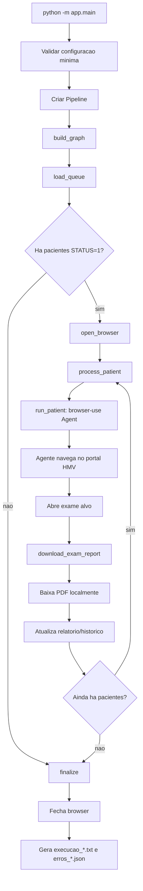
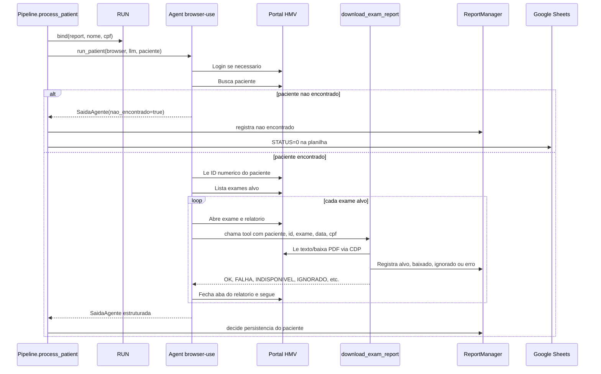

# Fluxo do agente

Este documento descreve como o extrator agentico percorre o projeto em tempo de
execucao: da leitura da fila na planilha ate o download local do laudo e geracao
dos relatorios finais.

Versao desenhada: [fluxo-agente-board.svg](fluxo-agente-board.svg).

## Visao geral

O projeto e um pipeline Python que combina tres responsabilidades:

1. **Orquestracao deterministica**: `app/pipeline/graph.py` controla o lote com LangGraph.
2. **Navegacao agentica**: `app/agent/runner.py` cria um agente `browser-use` com Gemini
   para navegar pelo portal HMV.
3. **Operacoes criticas deterministicas**: `app/agent/tools.py` baixa o PDF localmente
   e atualiza as contagens sem depender do texto livre do LLM.

O agente decide onde clicar, como buscar o paciente e qual exame abrir. Quando o
laudo esta aberto, ele nao tenta baixar o arquivo sozinho: chama a tool
`download_exam_report`, que executa a parte sensivel por CDP.

## Fluxo macro



## Entrada da execucao

O ponto de entrada e `app/main.py`.

1. `main()` imprime o inicio do pipeline e chama `asyncio.run(_run())`.
2. `_run()` exige `SHEET_URL` e valida o provedor de LLM configurado.
3. `_avisar_config()` alerta, sem abortar, quando as credenciais do portal estao
   ausentes.
4. O codigo instancia `Pipeline`, compila o grafo com `build_graph(pipeline)` e
   chama `graph.ainvoke({}, config={"recursion_limit": 10_000})`.
5. O `finally` chama `pipeline.shutdown()` para fechar o browser e gerar relatorio
   mesmo se houver excecao no meio do lote.

## Grafo LangGraph

O grafo e definido em `app/pipeline/graph.py` com os seguintes nos:

| No | Metodo | Responsabilidade |
|---|---|---|
| `load_queue` | `Pipeline.load_queue` | Le pacientes da planilha com `STATUS=1`. |
| `open_browser` | `Pipeline.open_browser` | Abre uma sessao unica de browser para o lote. |
| `process` | `Pipeline.process_patient` | Processa um paciente por vez com o agente. |
| `finalize` | `Pipeline.finalize` | Encerra recursos e gera relatorios. |

O estado do grafo usa `PipelineState`:

| Campo | Uso |
|---|---|
| `pacientes` | Lista de pacientes lida da planilha. |
| `idx` | Indice do paciente atual no lote. |
| `erro_fatal` | Erro de leitura da planilha ou condicao que impede o processamento. |

A funcao `route()` decide se o grafo deve seguir para `process` ou `finalize`.
Depois de cada paciente, `idx` e incrementado e o mesmo no `process` e chamado
novamente ate acabar a lista.

## Fila de pacientes

`app/integrations/sheets.py` le a primeira aba da planilha Google.

Um paciente entra na fila quando:

- a coluna `STATUS` tem valor `"1"`;
- a coluna `Por gentileza, informe o seu nome completo:` esta preenchida.

Cada item da fila vira um dicionario com:

| Campo | Origem |
|---|---|
| `sheet_row` | Linha real da planilha, considerando cabecalho. |
| `nome` | Nome completo informado na planilha. |
| `cpf` | Coluna `CPF`, quando existir. |

Quando um paciente termina sem falhas, `update_sheet_status()` altera `STATUS`
para `0`, removendo a linha das proximas execucoes. Se houver falha real de
exame, o status permanece `1` para permitir reprocessamento posterior.

## Criacao do agente

`app/agent/runner.py` monta os componentes usados por cada paciente.

### LLM

`build_llm()` escolhe o provedor por `LLM_PROVIDER`:

- `gemini`: cria um `ChatGoogle`;
- `bedrock`: cria um `ChatAWSBedrock` para Claude via AWS Bedrock.

No modo Gemini, o modelo usa:

- modelo principal vindo de `GEMINI_MODEL`;
- `temperature=0.1` para reduzir variacao;
- `max_output_tokens=16384` para evitar truncamento da resposta;
- ajuste de thinking para modelos Gemini Flash.

No modo Bedrock, o modelo usa `BEDROCK_MODEL`, `BEDROCK_MAX_TOKENS`,
`AWS_REGION` e o provider chain do boto3. O default e o exemplo usam Claude
Haiku 4.5 via `us.anthropic.claude-haiku-4-5-20251001-v1:0` (inference profile
`us.`, exigido pela AWS para esses modelos), chamado pelo
endpoint `bedrock-runtime` com a API Converse.
Se a autenticacao for por API key do Bedrock, o valor deve estar em
`AWS_BEARER_TOKEN_BEDROCK` ou `BEDROCK_API_KEY`; `AWS_ACCESS_KEY_ID` fica
reservado para chaves IAM/STS reais.
`build_fallback_llm()` cria um modelo reserva com
`GEMINI_FALLBACK_MODEL` ou `BEDROCK_FALLBACK_MODEL`, conforme o provedor.

### Browser

`build_browser()` cria um `Browser` do `browser-use` com:

- `headless` controlado por `HEADLESS`;
- downloads em `DOWNLOAD_DIR`;
- `keep_alive=True`, para manter a mesma sessao durante todo o lote.

Manter o browser vivo e importante porque o agente processa varios pacientes e
o login no portal deve ser reaproveitado.

### Execucao por paciente

`run_patient()` cria um `Agent` com:

- prompt gerado por `build_task(nome, cpf)`;
- LLM principal e fallback;
- browser compartilhado;
- tools customizadas de `app/agent/tools.py`;
- `output_model_schema=SaidaAgente`;
- `use_vision=False`;
- limite de `MAX_STEPS = 60`.

Ao final, o metodo retorna `SaidaAgente`. Se a saida estruturada nao vier no
formato esperado, retorna `SaidaAgente()` vazio para manter a orquestracao viva.

## Prompt do agente

`app/agent/prompts.py` constroi um prompt por paciente com:

- nome normalizado sem acentos;
- CPF quando disponivel;
- URL e credenciais do portal;
- instrucoes de login;
- estrategia de busca do paciente;
- regra para listar exames alvo;
- obrigacao de chamar `download_exam_report`;
- formato final da saida estruturada.

As regras principais do prompt sao:

- buscar o paciente pelo nome completo e, se necessario, pelo primeiro nome;
- considerar exames a partir de `EXAM_YEAR_CUTOFF`;
- focar exames com palavras-chave de mama;
- ignorar somente cards marcados explicitamente como `apenas imagens`;
- abrir o exame, clicar em `Imprimir` e chamar a tool;
- nunca baixar PDF manualmente;
- nunca reiniciar login ou reprocessar exame ja tentado;
- finalizar quando todos os alvos forem tentados.

## Fluxo por paciente



Antes de rodar o agente, `process_patient()` chama:

```python
RUN.bind(self.report, pac.nome, pac.cpf)
```

Isso permite que a tool saiba em qual paciente deve registrar contagens, porque
as tools do `browser-use` sao registradas em nivel de modulo.

## Contrato da saida estruturada

`SaidaAgente`, em `app/domain/models.py`, e o contrato de retorno do agente:

| Campo | Significado |
|---|---|
| `id_paciente` | ID numerico do paciente no portal. |
| `nao_encontrado` | `true` se o paciente nao foi localizado. |
| `exames_baixados` | Quantidade informada pelo agente. |
| `exames_indisponiveis` | Lista de exames marcados como indisponiveis. |

As contagens finais do relatorio nao dependem totalmente dessa saida. A fonte de
verdade para alvos, baixados, ignorados e falhas e a tool `download_exam_report`,
porque ela observa diretamente o resultado do download.

## Tool `download_exam_report`

A tool fica em `app/agent/tools.py` e recebe `DownloadExameParams`:

| Parametro | Obrigatorio | Uso |
|---|---|---|
| `nome_paciente` | sim | Compor historico e nome do arquivo. |
| `id_paciente` | sim | Compor a chave historica do exame. |
| `nome_exame` | sim | Identificar o exame e registrar relatorio. |
| `data_exame` | sim na pratica | Diferenciar exames de mesmo nome em datas diferentes. |
| `cpf` | opcional | Contexto para relatorios de erro. |

### Passos internos da tool

1. Obtem uma sessao CDP focada com `browser_session.get_or_create_cdp_session(focus=True)`.
2. Normaliza o ID do paciente para 16 digitos.
3. Monta `hist_id` com paciente, ID, data e nome do exame.
4. Verifica se o exame ja foi tentado nesta execucao (`RUN.ja_processou`).
5. Verifica se o exame ja foi baixado em execucao anterior (`historico_downloads.json`).
6. Marca o exame como tentado antes de processar, para evitar loops.
7. Registra um alvo no `ReportManager`.
8. Le o texto do relatorio para detectar:
   - carta/procedimento que deve ser ignorado;
   - mensagem de laudo indisponivel.
9. Gera um nome unico de PDF com paciente, exame, data e timestamp.
10. Chama `extract_report_pdf()` para salvar o PDF.
11. Atualiza historico e relatorios conforme o resultado.

### Respostas possiveis para o agente

| Resposta | Significado | O que o agente deve fazer |
|---|---|---|
| `OK` | PDF baixado localmente. | Seguir para o proximo exame. |
| `FALHA` | PDF nao foi extraido. | Tentar seguir ou registrar falha. |
| `INDISPONIVEL` | Portal informou laudo indisponivel. | Registrar e seguir. |
| `IGNORADO` | Texto indica carta/procedimento, nao exame diagnostico. | Nao salvar como laudo e seguir. |
| `JA_BAIXADO` | Historico persistente indica download anterior. | Pular. |
| `JA_PROCESSADO` | Exame ja foi tentado nesta execucao. | Nao reabrir nem repetir. |

## Extracao do PDF

`app/agent/extraction.py` usa CDP porque o `browser-use` nao expoe diretamente a API do
Playwright.

A ordem de tentativa e:

1. **FETCH**: executa `fetch()` dentro do browser para baixar o conteudo de
   `blob:` ou `iframe`, reaproveitando cookies da sessao.
2. **HTML->PDF**: se o fetch falhar, usa `Page.printToPDF` para renderizar a
   pagina atual como PDF.

O metodo usado e retornado para a tool, que registra estatistica em
`ReportManager.registrar_metodo()`.

## Filtros de exame

`app/domain/filters.py` contem funcoes puras, cobertas por `tests/test_filters.py`:

| Funcao | Regra |
|---|---|
| `check_exam_date` | Aceita exames com ano maior ou igual a `EXAM_YEAR_CUTOFF`. |
| `is_relevant_exam` | Aceita nomes com keywords de mama e sem keywords excluidas. |
| `texto_indica_skip` | Detecta cartas/procedimentos pelo texto do laudo. |

O prompt instrui o agente a aplicar as regras de data e keywords ao listar os
cards. A tool reforca a regra mais critica no texto real do laudo: cartas de
procedimento nao sao salvas como laudos baixados.

## Historico e retomada

O projeto evita retrabalho em tres niveis:

| Nivel | Onde | O que evita |
|---|---|---|
| Planilha | `STATUS=0` | Reprocessar paciente concluido em execucoes futuras. |
| Historico persistente | `data/historico_downloads.json` | Rebaixar exame ja baixado antes. |
| Estado de execucao | `RUN._processados` | Reabrir o mesmo exame em loop dentro da mesma execucao. |

O historico persistente so e gravado quando:

- o PDF foi baixado localmente com sucesso;
- ou o exame foi ignorado por ser carta/procedimento.

Falhas de extracao ou laudo indisponivel nao saem definitivamente da fila por
historico persistente. Assim, podem ser reprocessadas depois.

## Relatorios

`ReportManager`, em `app/reporting/manager.py`, gera dois arquivos em `REPORTS_DIR`:

| Arquivo | Conteudo |
|---|---|
| `execucao_*.txt` | Resumo do lote, tempo total, pacientes, baixados, ignorados, falhas e metodos de download. |
| `erros_*.json` | Lista estruturada de erros com paciente, CPF, exame, data, etapa e motivo. |

As contagens por paciente incluem:

- `alvos`;
- `baixados`;
- `ignorados`;
- `falhas`.

## Decisao de status da planilha

Ao fim de cada paciente, `_persist()` aplica estas regras:

| Situacao | Acao |
|---|---|
| Excecao na sessao do agente | Registra erro e mantem paciente na fila. |
| Paciente nao encontrado | Registra erro, marca `STATUS=0` e conta como processado. |
| Paciente processado sem falhas | Marca `STATUS=0`. |
| Paciente com falhas | Mantem `STATUS=1` para retentativa futura. |

## Responsabilidades por arquivo

| Arquivo | Responsabilidade no fluxo |
|---|---|
| `app/main.py` | Iniciar execucao, validar configuracao minima e garantir shutdown. |
| `app/pipeline/graph.py` | Orquestrar lote, browser, loop por paciente, persistencia e relatorio. |
| `app/agent/runner.py` | Criar LLM, browser e agente `browser-use`. |
| `app/agent/prompts.py` | Montar tarefa do agente para um paciente. |
| `app/agent/tools.py` | Implementar `download_exam_report`, fonte de verdade das contagens. |
| `app/agent/extraction.py` | Extrair PDF do laudo via CDP. |
| `app/integrations/sheets.py` | Ler fila e atualizar `STATUS` na planilha. |
| `app/reporting/manager.py` | Acumular estatisticas e gerar relatorios. |
| `app/domain/history.py` | Normalizar nomes e manter historico de downloads. |
| `app/domain/filters.py` | Regras puras para data, relevancia e skip de laudo. |
| `app/core/runstate.py` | Estado compartilhado entre grafo e tool durante um paciente. |
| `app/domain/models.py` | Schemas Pydantic compartilhados. |

## Pontos de atencao

- A navegacao no portal e agentica, portanto pode variar conforme a tela, mas a
  captura do laudo e deterministica.
- A tool deve ser chamada somente com o relatorio aberto e em foco.
- `data_exame` e essencial para diferenciar exames repetidos em datas diferentes.
- A saida estruturada do agente e util para controle, mas as metricas finais
  devem vir da tool.
- O browser e compartilhado no lote; matar a sessao entre pacientes pode quebrar
  o reaproveitamento de login.
- Uma falha ao baixar um PDF nao significa perda de sessao no portal; o prompt
  orienta o agente a continuar para o proximo exame.

## Como validar rapidamente

Para validar apenas regras puras:

```bash
pytest tests/
```

Para validar o fluxo real:

1. Configure `.env`, `credenciais.json` e uma planilha com um paciente `STATUS=1`.
2. Rode com janela visivel:

```bash
HEADLESS=false python -m app.main
```

3. Confirme:
   - leitura da fila;
   - login ou reaproveitamento de sessao;
   - busca do paciente;
   - abertura de exames alvo;
   - chamada da tool `download_exam_report`;
   - PDFs em `data/downloads/`;
   - relatorios em `data/reports/`;
   - atualizacao do `STATUS` na planilha quando nao houver falhas.
